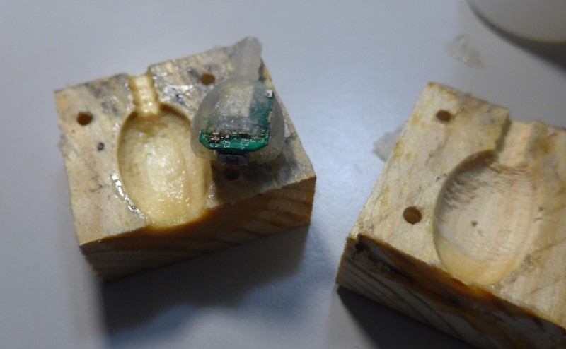

# Bluetooth Low Energy Thermometer

This project describes a bluetooth low energy thermometer.

All code licenced as GPLv3, all documentation and PCB as CC0.

## Purpose
### Conceptual idea: fertility awareness method thermometer

The fertility awareness method, especially the symptothermal method, is a method to classify a woman's fertility by carefully monitoring symptoms of the body to be able to know in which state of the menstrual cycle she is.
One of the monitored symptoms is the body temperature:
The fundamental body temperature is normally taken early in the morning, directly after waking up after a restful sleep.
Women using this method, mostly use a clinical thermometer that has two digits, so a resolution of 0.01 °C.
To get an accurate measurement, measuring inside the vagina or the anus for at least 2 minutes is strongly recommended.
Because of practical reason, most chose to measure inside the vagina.

As a fan of natural birth control, I wanted to support woman by providing a device that relieves them of some stress of the temperature measurement as well as provides additional, maybe interesting data:
  * Not having to think about measuring the temperature in the morning
  * Not having to set an alarm for the same time (for some people the measurement time has a strong influence on the temperature, so you should always measure at a similar time)
  * Being able to detect factors that change your temperature more easily
  * Maybe even providing a better safety of the method by providing more data
  * Not having to immediately write down the measurement result

So the idea was born:
A thermometer, 
  * that can be inserted into the vagina
    * over night
    * the whole day
    * maybe even just in the early morning for some minutes
  * that records and stores the temperature
  * that can be read out using a smartphone or a computer
  * where there is high value on the ease of use as well as user privacy (no cloud service)
  * that does not hide the complexity of the symptothermal method (e.g. ONLY a thermometer, not a full birth control solution)

Initially, I wrote down more thoughts in a [design.md](design document) which is very far from how reality evolved.

I decided to go for the following system design:
  * Battery powered device powered by the ST SPBTLE-1S Bluetooth low Energy System-on-Chip application processor
  * Bosch BMP280 temperature/pressure sensor (because its high accuracy, low power usage, ease of use and my experience with it)
  * BR1632 lithium coin cell (because of availability as high temperature device)
  * altogether put on a small pcb surrounded by silicone to be completely safe to be used in contact with skin or mucous membrane

This design has a few limitations that are clear even before the first prototype has been built:
  * Limited battery lifetime: Device becomes unusable after ~1-3 years
    * Battery can be exchanged by replacing the silicone
  * High price: Pure materials cost ~15 € per piece
  * Silicone mould might need fiddling a bit

## Prototype

## System architecture
The SPBTLE-1S is a System-on-Chip including a Cortex M0 processor, some flash and Ram, typical microcontroller peripherals and a bluetooth low energy radio.
The bluetooth low energy radio comes with a proprietary, binary-only library, that is linked to the custom user program and provides high level methods to configure the bluetooth part of the device as well as transfer data.

Different libraries are provided by ST that allow creating a running application easily.

The device contains two softwares:
  * The OTA Service Manager, which openly listens for bluetooth connections to reprogram the firmware. It is started after powerup and automatically boots the application software after some seconds.
  * The actual application software. It implements a "safety feature" Long pressing the button (for > 25 seconds) resets the chip, starting in the OTA Service Manager.

## Theory of operation
The thermometer device has different operating modes, whereby it should be kept in mind that the device itself can never be completely powered off.

  * Standby: Time-tracking mode, just counts how long in the past the last measurement has been taken. Can be woken up by button press.
  * Recording: The device takes a measurement point in a fixed (but configurable) interval. Up to 4096 points can be stored before the oldest one gets overwritten.
  * Connectable: The device advertises its Bluetooth low Energy services and is connectable by a paired device. As this mode takes quite some power, it should only be active for a short time.
  * Connected: The device is connected to another device. Data can be read out, configuration can be changed. This mode also takes a bit more power and should only be active for a short time.
  * Pairable: The device advertises its services and is connectable and pairable by other devices. 

